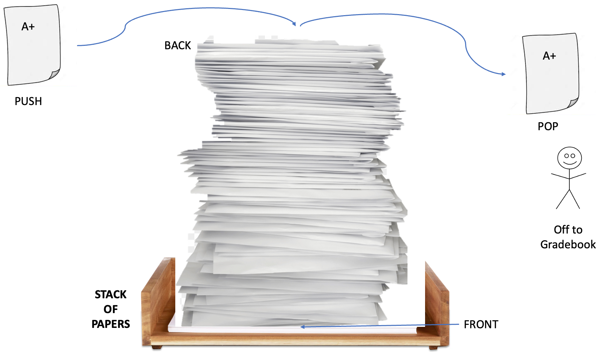

# Stacks

Welcome to the Stacks data structure tutorial. This will help you understand what a python stack is and how to use it. 
First let's answer what a stack is. A stack is a data structure that is much like an array but the order in which things are added and removed is unique, it uses what's called the "Last In, First Out" (LIFO) method meaning that the last item added to the array is at the end and so if you remove something from the end, the last item will become the first removed item. Stacks maintain a history of what was added which makes it very easy to go back and find items.
## TOPICS FOR THIS SECTION:  
* Push and Pop
* Applying to Python 
* Instructor Example
* Problem to Solve
* Algortithmic Efficency

## **Push and Pop:** 
**Real world example:**  
Let's say you are grading papers for a class, there is a finished papers bin waiting for you, each time you add a graded paper to the bin we will call that a **Push**. Each time you finish a paper you would add it to the top, in python we call the top the **Back** meaning the end of the pile. Now we have to input the grades, each time we take a paper off the top (back) of the stack that's called a **Pop**. It is important to note that we only can push and pop from the back, or the top, of the stack because all the other papers are covered by the top. The **Front** then refers to the beginning or the first paper that we graded. This is really helpful to remember the order in which we did things. Begin thinking of how we might access the first graded paper. Now let's appply this to Python code.


## **Applying to Python:** 
Stacks are often used in Python without us knowing. When a function is called it uses a stack to keep track of the order of functions, code debuggers also use stacks to help keep track of when to pause the code. They are all around us. They are especially useful to reverse the order of an array. 

To initialize a stack we do it the same way as an array:
```python
Stack = []
```
To Push a value to the back of the stack (top of our graded pile) we use append:
```python
stack.append(value)
```  
To pop a value we must remember it pops off the last value added to the back of top of pile and then we need a place to store that poped vlaue. The point of a pop is to use the value. (**Note:** The pop function deletes the value popped from the stack). It removes and returns that value: 
```python
value = stack.pop()
``` 
We can also check the size of the stack the same way we do with an array usuing length.
```python
length = len(stack)
``` 

## **Instructor Example:** 
Using our classroom example, lets say we have papers to grade, we are going to add 10 graded papers to our stack starting from 1 to 10, and then pop and display each value using a loop until we find the first paper we graded, so we can record it in the gradebook. This will reverse the order of our list when we pop. 

**Code:**
```python
# Define our variables.
num_papers_to_grade = 10
graded_papers_stack = []

# Loop through each value(Paper) and add it to our stack one by one.
for number in range(1, num_papers_to_grade + 1):
    graded_papers_stack.append(number)

# Pop off each value until there is nothing left.
while len(graded_papers_stack) > 0:
    value = graded_papers_stack.pop()
    # Print each time we loop to dispay all values.
    print ('The value popped in the stack is:', value)
``` 
**Output Values:**  
The value popped in the stack is: 10  
The value popped in the stack is: 9  
The value popped in the stack is: 8  
The value popped in the stack is: 7  
The value popped in the stack is: 6  
The value popped in the stack is: 5  
The value popped in the stack is: 4  
The value popped in the stack is: 3  
The value popped in the stack is: 2  
The value popped in the stack is: 1 (The one we wanted)

**Resuts:**  
We can see here that the last time we run the loop is when we get to our first paper that we graded.   
**Critical thinking:** What could you add to this code that will add the reversed values to a new array?

## **Problem to Solve:** 
Now it will be your turn. Make a program that stacks chairs in a classroom, design and stack 25 charis onto your new stack. You then realize chair 12 is broken and you must remove it from the stack. Using the pop function pop off values until you hit the 12th chair and then display that chair.   
**Note:** Only display the desired chair, not each popped value.


```python
stacked_chairs_stack = []
# Your Code Goes here:


print ('The broken chair in the stack is:', value )
# Expected output: 
# "The broken chair we removed from the stack is: 12"
``` 
### Bonus Challange: 
Modify your code so that any value input by a user will be the value in the stack that gets popped off. 

## Code Solutions:
* [Click here for Instructor solutions](Stacks_Problems_Solved.py)

## **Algortithmic Efficency (Big O Notation):** 
Let's take a look at performance, think of the performance what of a stack would be. Looking at things simply, if we look at just the append and pop functions by themselves, they only have to do that action once, you don't have to traverse the whole stack to add something to the end, and you dont have to traverse it to pop somehting off the end either. Both of these functions are **O(1)** efficent in Big O Notation, meaining it takes one operation to complete. Now we have to look at the big picture, what happens if we want to pop off the first item we added to the list? This requires us having to pop off each value before it, for the length of the stack. That means this operation, of repeating a pop, gives the efficency of **O(n)**, meaning it will take 1 operation times the length of the list, so the size of the list (our n in Big O Notation) determines how much work our program needs to do. The work required is based on the length of the stack. 

## [RETURN TO MAIN PAGE](0-Welcome.md)