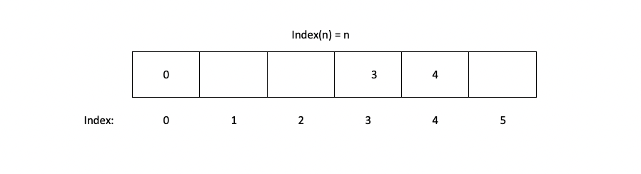
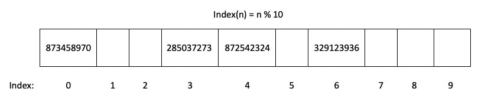
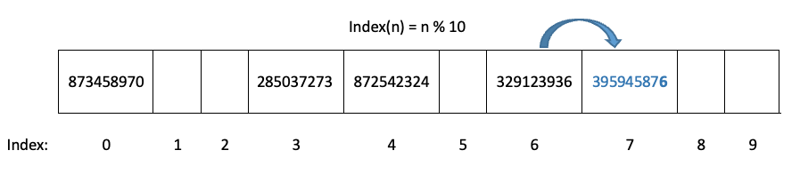
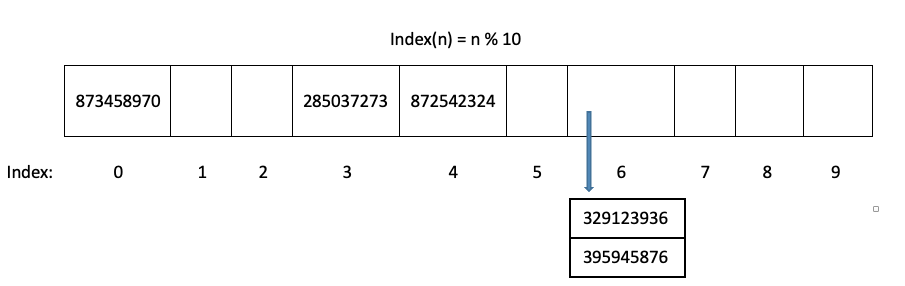
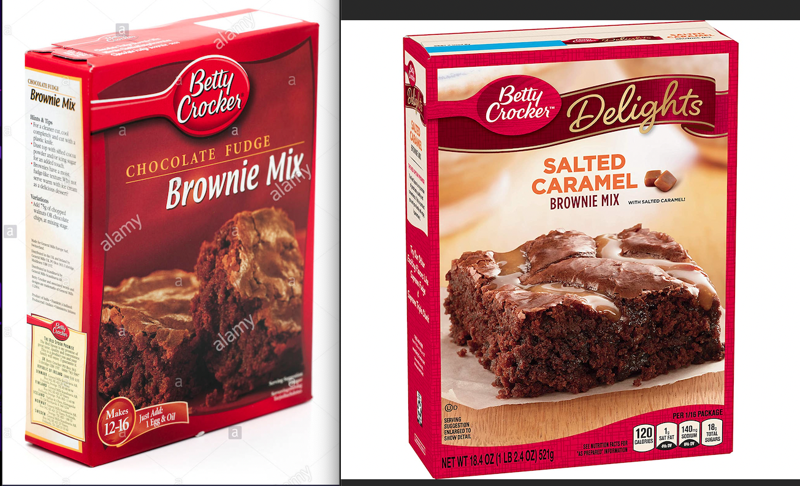

# Sets

Welcome to the Sets data structure tutorial. This will help you understand what a python set is and how to use it. 
First let's answer what a set is. A set is a data structure that is still like an array but with a very different distiction. As with most data sets we have studdied before, the order matters, everything is added to the end or the beinning in oder, from frist to last, and they must be removed in order. Sets are different. Sets **Do not** need order. We add items to different places and retrive them using **Hashing** which will be discussed later. The best uses for sets are thier incredible performance which we will also discuss.

## TOPICS FOR THIS SECTION:  
* Sparse Listing
* Hashing
* Conflicting Inputs
* Applying to Python
* Instructor Example
* Problem to Solve
* Algortithmic Efficency

## **Sparse Listing:** 
**Real world example:**  
Let's say you baking a cake, the order in which you add the ingredients does not matter as long as you add them all before you put it the oven. But what happens if you don't keep track of what you added, there is a posability that you foget you already added flour and then you add it again, doubling the flour and ruining your cake. This can be a big issue in sets. Thankfully the set has a constraint, a built in check to look and see if what we want to add is already there, this would be like checking off each ingredent from the recipe as you add it to the bowl. Order doesn't matter but you still keep track of what you add. Sets work this way.  


**Sparse Listing:**  
So how do we add items to our set without order? Knowing we can't add duplicates, the easiest way to add to a list is to use the index function. Lets say we wanted to add the numbers 0 - 5 to a list, but out of order, starting with 3 for example. We know that if we have five items we **Have** to have an array with size 6, with indexes going from 0-5. Once we determine the size all we do is add the number we want (3) to our list at `index[3]` and we are good, as long as the size holds up we can add 3 and the other spots just remain empty. We can add 4 and 0 the same way, at the end we have a list like this. 

The list above shows some numbers added, not in order, with spaces in between. This is called a **sparse list**. We achive this using the rule **index(n) = n.** We avoid duplicates usuing the same rule to check. If we want to know if a number is in the list we can use the same formula just to look it up by it's index. Notice that the order is not the same as with a normal array, becuase the list does not have to be filled from left to right. This sparsed array is called a **Set**.

## **Hashing:** 
When adding to sets as a sparsed list we create a new problem. What if we want to add a list of numbers from 1 to 10 million? That means we have to have an array with size 10 million. This takes up too much memory. To fix this we can look at memory a different way. Would it be possible to store multiple numbers at index[0] for example? The answer suprisingly, is yes! This is called **Hashing**. We can accomplish this by using the modulo (%) operator. If we write the equation as **index(n) = n % 10**, then we would be able to store values properly. What this is doing is storing each value in an array from index[0] to index[9] and the modulo (%) operator cuts off everthing but the last number (remainder). This number at the end will be the index at which we store the whole number. For example lets say we wanted to store the number 329,123,936. Usuing the equation we get index(329,123,936) = 329,123,936 % 10 = 6. So we store the entire number in index 6. 872,542,324 would go in index 4 and so on. 
Here is an example:   
  
We can generalize the equation used by saying, **index(n) = n % sparse_list_size**. This works with numbers, and even strings of letters, and words as well. This is actually a common method for creating password keys. However you **Cannot** hash lists.

## **Conflicting Inputs:** 
If we only have 10 spots in our set, but we have to add, 100 numbers, we can see that there might be some conflit. For example, we added the number 329,123,936 to index 6 in our array, but what would happen if we wanted to add 395,945,876. This number would aslo be placed at index 6. This is a conflict.  

**Handeling Conflict:**  
There are 2 main ways we can fix this, **open addressing** and **chaining**. Let's focus on the first. Open addressing means that if we use the index(n) hashing function and find that something is already in that spot (or the item in that space is not what we are looking for) then we just move one by one down the list till we find the next available space. The danger in this is that putting something in a space that's marked differently, can crate more conflicts and then we will have to move those. For the example below if we add, 395,945,876 into spot 7 it's full, then if we wanted to add 837,874,0927 for example, we would have to add that to index 8, and any number we add to spot 8 creates another conflct, and the problem grows.  
  
The next option we have is **Chaining**. Instead of looking for a new place for the number we just make a link to a new list that is in the same index. This helps us to avoid increaing conflicts, but has another side effect. If the link with the new list becomes too large, it can cost much more effort to look through, slowing things down. To avoid this we can just increase the size of the origional set. When we do this we need to reposition all of the values by running the index(n) function again with the new size. This will help things from getting to big.  This is the solution python uses. 


## **Applying to Python:** 
Sets are often used in Python. They are very helpful in finding unique values in a list. They also can provide quick access to unique results and can help perform math operations. Sets also have fast perfomance and perhaps the best thing is that no duplicates are allowed. The lack of order also can be useful. Let's see how we code it in python. 

To initialize a set we do it using parentheses and set:
```python
set = set()
```
To add a value to the set we simply use the add function:
```python
set.add(value)
```  
To remove a vaule we can simply remove it usuing the remove function: 
```python
set.remove(value)
``` 
To check if something is in the array we can use the in operator which just checks if the value is in the set, we use a simple `IF` statement for this.
```python
if value in set:
    #(Then do someting)
``` 
We can also check the length of the set the same way we check the length of an array. Using the length function.
```python
length = len(set)
``` 
Even more exciting, we can use sets to do math, let's say we wanted to perform an intersection, this means we combine 2 sets but the end result is only a set of the numbers that were the same between the 2 sets. For example:
```python
set1 = {1, 2, 3, 4}
set2 = {3, 4, 5, 6, 7}

set3 = intersection(set1, set2)  # This will result in {3, 4}
set3 = set1 & set2               # Alternate way of doing an intersection
``` 
We can also do a union, which combines 2 sets and removes duplicates as it combines. For example:
```python
set1 = {1, 2, 3, 4}
set2 = {3, 4, 5, 6, 7}

set4 = union(set1, set2)  # This will result in {1, 2, 3, 4, 5, 6, 7}
set4 = set1 | set2        # Alternate way of doing a union
``` 

## **Instructor Example:** 
Using our cake example, lets say we have a cake to bake, we are going to add 6 ingedients to our set. We are going to combine the salt and flower and sugar in one bowl (set), and the egg, butter, and milk in another bowl (set). We can add one egg to both sets just to see how the set combines values as well (leaving 6 items in total). At the end we will perfom a union of the 2 bowls (sets) to create one complete set to bake. Lastly we will test the remove function. Let's say we accedentally added vinigar to our cake, in real life that's hard to remove but in this example we can, we will seach for vinigar in the set and remove it before we print the final complete set.  
**Code:**
```python
# Define sets.
dry_items_set = set()
wet_items_set = set()

# Add dry ingredients.
dry_items_set.add("salt")
dry_items_set.add("flour")
dry_items_set.add("sugar")
dry_items_set.add("egg")
# Check our set.
print("Dry set:",dry_items_set)

# Add wet ingredents.
wet_items_set.add("egg")
wet_items_set.add("butter")
wet_items_set.add("milk")
wet_items_set.add("vinigar")
# Check our set.
print("Wet set:",wet_items_set)

# Unite the sets. (Notice it removes the duplicate egg.)
cake_set = dry_items_set | wet_items_set
# Check new set.
print("New set:",cake_set)

# Remove vinigar using in and remove operations.
if "vinigar" in cake_set:
    cake_set.remove("vinigar")

# Check our final cake set.
print("Final Cake:",cake_set)   
``` 
**Output Values:**  

Dry set: {'flour', 'sugar', 'egg', 'salt'}  

Wet set: {'milk', 'vinigar', 'egg', 'butter'}  

New set: {'milk', 'egg', 'salt', 'flour', 'sugar', 'vinigar', 'butter'} 

Final Cake: {'milk', 'egg', 'salt', 'flour', 'sugar', 'butter'}  

(Notice how the set is displayed here)

**Resuts:**  
We can see here that the our values were added to the set, but they were not added in order, even when united they do not merge in order either, this is how the set functions. 

## **Problem to Solve:** 
Now it will be your turn. You are making 2 different kinds of brownies, you want to limit your trips to the fridge to get ingredents, so you need to find out which ingrednets are the same between both mixes. Write a program that will merge the 2 recipe sets in an intersection and then display them so you can get those ingredients. Now you are making the bownies, but you realied you added the caremel to the wrong brownie mix! Check that it is in the rgular brownie set and then remove it (it is possible with sets.) Then add it to the right set. But oh wait, you already did! Write the code to add a duplicate caramel to see what happens, and make sure there is only one in your final set. Last, display both original sets and your new intersected set.


```python
# Define sets.
regular_brownie_set = {"salt","flour","egg","chocolate chips","cinamon","caramel"}
caramel_brownie_set = {"salt","flour","egg","caramel","nuts"}

# Your code to perfrom the intersction here:

# Remove caramel from regualr brownies here:

# Try adding duplicate caramel to caramel brownies here:

# Print final sets.

print("Ingredints for both brownie mixes:",common_items)
# Expected output (Oder does not matter): 
# Ingredints for both brownie mixes: {'caramel', 'salt', 'egg', 'flour'}
# Notice caramel is in this list, this is because it's merged before you remove it 
# (That's how you notice.)

print("Final regular brownies:",regular_brownie_set)
# Expected output (Oder does not matter):  
# Final regular brownies: {'salt', 'egg', 'chocolate chips', 'flour', 'cinamon'}  

print("Final caramel brownies:",caramel_brownie_set)
# Expected output (Oder does not matter):  
# Final caramel brownies: {'caramel', 'salt', 'egg', 'nuts', 'flour'}
``` 
### Bonus Challange: 
Play arround with combinations of words and numbers, try adding different things and see how the sets behave, try to remove duplicates or find pairs of numbers. 

## Code Solutions:
* [Click here for an Instructor solution](Sets_Problems_Solved.py)

## **Algortithmic Efficency (Big O Notation):** 
Let's discuss what the performance of a set would be and apply Big O Notation. Take a moment to think about it first. One of the best things about a set is its performance. Since we add items to our array, and hash by index the perfromance of adding is simply **O(1)** in Big O Notation. It takes just one operation. Removing is the same since we remove by index as well. Another amazing thing is that if we want to look up items we look them up by the index using the same function meaning we do not have to go through the whole set to find an item, meaning the perfomance still wonderfuly  **O(1)**. Let's say we need to hash, guess what, same thing! **O(1)**. This is because everything uses **index(n) = n % sparse_list_size** or **hash(n) % sparse_list_size.** The only time we might ever have a performance issue is when chaining. This could lead to **O(n)**, (This occurs when the index that has the list basically has so many values that it becomes a new list just as big as the list we origionally linked it to) if there are too many items in one chain, we can just we rehash. This is one of the best options for performance which makes sets so important.

## [RETURN TO MAIN PAGE](0-Welcome.md)