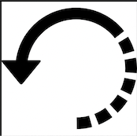

# Recursion

Welcome to the recursion tutorial. This will help you understand what python recursion is and how to use it. 
Recursion is a difficult idea in python. It is not a data set but rather a method of execution. Have you ever accidentally typed a `FOR` loop wrong and it ran forever in a loop? Have you ever wondered why this is, or if there is any use for it? That is the basis of recurison. Recursion however, uses functions and function calls. Simply **Recursion** is a technique where a function calls itself.

## TOPICS FOR THIS SECTION:  
* How It Works
* Base Cases And Smaller Programs
* Instructor Examples
* Memoization
* Algortithmic Efficency

## **How It works:**  
   
The best way to understand recursion is to see it in code. Here's an example:  
```python
def recursion_function():
	print("Recursion")
	recursion_function()  # This is the recursive call
```
Here the function `recursion_function` calls itself, as you can probably tell, this will print "Recursion" infinitely. There is nothing to stop this loop, we won't even see recursion print because the loop never stops to do the first print. Thankfully Python will eventually stop with a "RecursionError" because the `recursion_function` function was called too many times. So python can detect this. So if Recursion is a function that calls itself, we need to find a way to stop it so we can use it to help us. 

## **Base Cases And Smaller Programs**  
In order for Recursion to stop and actually produce a result we need an end goal, something the loop is working towards. To achive this two very important things need to happen. The first is this end goal. This is a **Base Case**. A base case is the last time we want to loop to run, it is usually a truth, something we know, that once we hit, the loop stops. The next thing we need is a way way to keep track of our loops, and then somehow decrease the loop each time until we hit the lowest option. This is what we call the **Smaller Problem**. Consider the Following Code:  
```python
def recursion_function(count):
	if count <= 0:  # This is the Base Case
		return
	else:
		print("Recursion")
	    recursion_function(count-1)  # This is the recursive call (With a smaller problem)
```
Here the base case is when the counter hits 0, then the loop stops, the smaller problem is the count minus one each time we call the funtion back on itself. This allows the loop to decrease each time, so if count starts at 10, this loop will print "Recursion" 10 times then stop. It is important to note here that this can be accomplished with a simple `FOR` loop, and recursion usually has low performance so it should not be used in all cases, but it can be very helpful for specific thigs such as Trees which we will discuss later. 

## **Instructor Examples:** 
Looking at a simple example, let's display a word one letter at a time usuing recursion. Python has a trick we can use to split words up by letter, like this: `word[:a] = Index 0 to 'a' (not including 'a')`.  
 **1.** Let's look for a base case. We can use the idea that once there are no letters left we have displayed the whole word and we can stop, or when the length of the word is 0, We return.  
  **2.** Let's look for a smaller problem, to think of this one we need to break up our word. We can display one letter, and then the rest of the word, then the next letter, and then the rest of the word, and so on until we run out of word. We will spell out, "Algorithm". Have a look at the Code below.  

**Code:**
```python
def display_word(word):
    # Base Case
    if len(word) == 0:
        return
    
    print(word[0]) # Print Each letter, once you hit the end. 
  
    display_word(word[1:]) # Recursion on the next letter. 

display_word("Algorithm")
``` 
**Output Value:**  

A  
l  
g  
o  
r  
i  
t  
h  
m  

**Resuts:**  
We can see here that the recursion printed the word one letter at a time, this is a good example of a base case with a smaller problem. 

Lets look at one more problem, this one will involve some math. There is a sequense in math called The Fibonacci numbers, they are: 1, 1, 2, 3, 5, 8, 13, 21, and so on. The sequence starts with two 1's, Then the next number is the sum of the two previous numbers. We can write the equation like this: **fib(n) = fib(n-1) + fib(n-2)**. To start let's find a base case. We know the first two numbers are 1's so they can be our base values, the simplest item we know to be true. **fib(1) = 1, fib(2) = 1.** Then we need a smaller problem to solve, we can simply use our equation: **fib(n-1) + fib(n-2)**, this is the smaller problem that will be passed back in to compute the sequense.   if we want the 6th Fibonacci number, it will look like this: 
 ```python
def fib(n):
	if n <= 2: 
        print("First print:", n)  # Print statement to track the loop. 
		return 1    # fib(2) = 1 and fib(1) = 1
	else:
        print("Second print:", n)  # Print statement to track the loop.
		return fib(n-1) + fib(n-2)  # fib(n) = fib(n-1) + fib(n-2)

print("The 6th", "Fibonacci number is: ", fib(6))       
``` 
**Output Values:**  
Second print: 6  
Second print: 5  
Second print: 4  
Second print: 3  
First print: 2  
First print: 1  
First print: 2  
Second print: 3  
First print: 2  
First print: 1  
Second print: 4  
Second print: 3  
First print: 2  
First print: 1  
First print: 2  

The 6th Fibonacci number is:  8

**Resuts:**  
We can see here that the recursion printed 8, which is correct. I added some print statements within the loop so you can see the values being calculated. Notice some numbers are calculated more than once, this is becuase each time it computes a value, it has to go back and resolve the remaining lower values. This is terrible performance. In fact in Big O notation, this is considered, **O(2^n)**. Just about the worst performance there is, just the 6th number took 15 loops. But what if there was a way to fix this, what if our program could remember the previous values it has calculated, and store them somewhere so we don't need to recalculate them each time we call the function again? Let's explore this Idea. 

## **Memoization** 
There is a way that we can increase the performance of Recursion by remembering the previous values that we have calculated already. This is called **Memoization**. For example, once we discover that the 3rd Fibonacci number is equal to 2, we can store this into a Python dictionary with a key equal to 3 and the value of 2. This becomes a base case. If we need to calculate the 3rd Fibonacci number again, we will just look up the 3 in the dictionary to get the answer. Let's look at a code example using Memoization: 
 ```python
def fib(n, remember_dict = None):
    # If this is the first time calling the function, then
    # we need to create the dictionary.
    if remember_dict is None:
        remember_dict = dict()

    # Base Case
    if n <= 2:
        return 1

    # Check if we have solved this before
    if n in remember_dict:
        return remember_dict[n]

    # Otherwise solve with recursion
    answer = fib(n-1, remember_dict) + fib(n-2, remember_dict)

    # Remember result for potential later use
    remember_dict[n] = answer
    return answer
    
    
#Print some test numbers
print(fib(6))
print(fib(100))  

    # Thanks to Brother Macbeth for the Code Example for Memoization.
``` 
**Output Values:**  
8   
354224848179261915075   

**Resuts:**  
We can see here that the recursion printed the values correctly, and the dictionary Memoization helped us to achieve the same result with better performance. 

## **Algortithmic Efficency (Big O Notation):** 
Now let's discuss what the performance of Recursion looks like. The performance of Recursion is generally on the lower side, this is why we only use it in certian cases, and for Tree data structures. Usually the Performance is **O(n^2)**. Meaning for each input it will take twice as many loops to compute. Sometimes even **O(2^n)**, which is exponentially large, depending on the code, but that is why it is important to understand when and how to use them effectivly. We usually use recursion to help caluculate long math equations, and things that need to be repeated. We also use them for Trees. 

## [RETURN TO MAIN PAGE](0-Welcome.md)