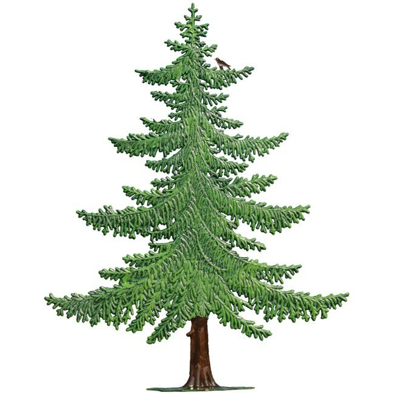
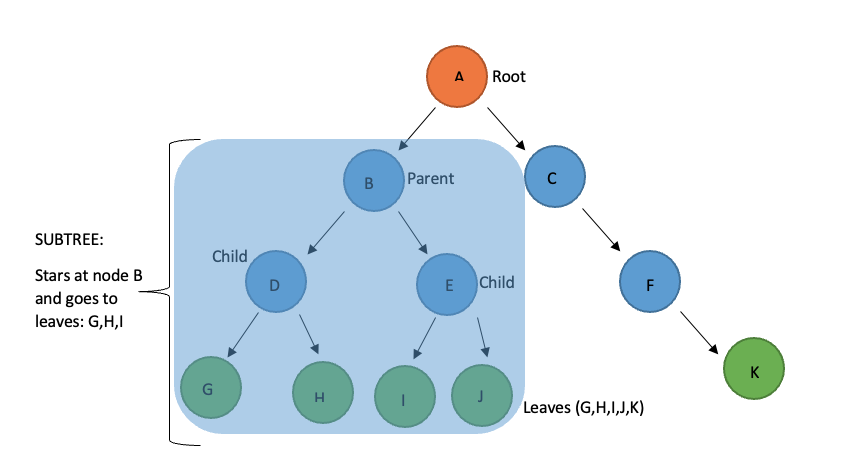
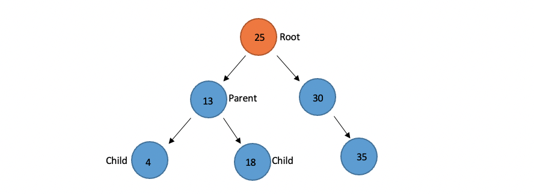
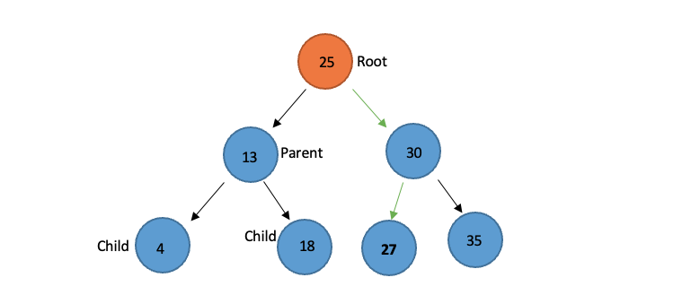
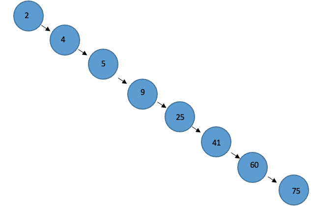
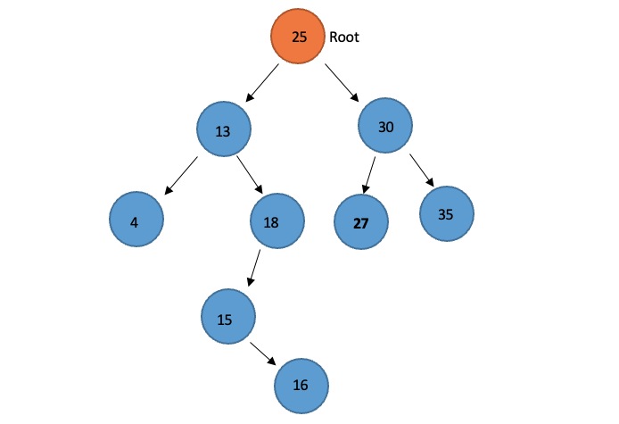
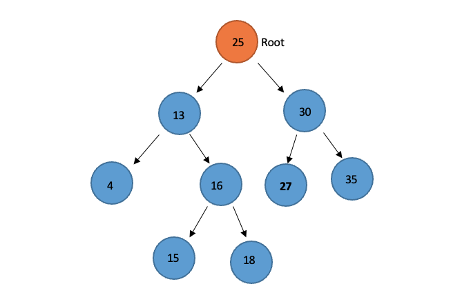
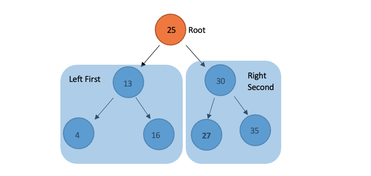

# Trees

Welcome to the Trees data structure tutorial. This will help you understand what a python Tree is and how to use it. 
First let's answer what a Tree is. A Tree is a data structure that is like a linked list, where there is a node connected by pointers, but trees are different because a Tree can connect to multiple different nodes. There are different types of trees such as, binary trees, binary search trees, and balanced binary search trees.

## TOPICS FOR THIS SECTION:  
* Recursion Review
* Binary Search Trees
* Inserting into Trees 
* Balancing Trees
* Traversing Trees
* Applying to Python 
* Instructor Examples 
* Problems to Solve
* Algortithmic Efficency

## **Recursion Review:** 
  
Trees are easy to vizualize in python but can be dificult to actually understand and work through. In order to set up and use values in trees, we need recursion. In python we will have a tree function that calls itself, and adds values to the tree each time it's called again. We will use this recursion to build the trees, and then use it again to traverse them and find the values we need. Please have this in mind as we work to build our Trees.

## **Binary Search Trees:** 

**Real world example:**   
  
A tree is a very well named example for this type of structure because like a tree we have one top point, or Node, and then many branches that come out and expand. Take a look at all the parts of this Tree. A **Binary Tree** links only two other nodes. In the picture below, the top node is called the **Root Node.** The nodes at the end are called **Leaf Nodes.** A node that has connected nodes is called a **Parent Node.** We can think of this like the branches of our tree. The nodes connected to the parent are called **Child Nodes.** The smaller branches. The nodes to the left and right of any parent node form a **Subtree.**  This subtree is what we will use as the **Smaller Problem** in our recursion. There is always only one root node.   
   
**Binary Search Trees:**  
Binary Search Trees (BST), take this tree form, but have different specific rules they follow about how the data is added with recursion. These rules keep things ordered so that we can look up and find the values we need later. Values are placed into the **BST** by **comparing** the current value with the value in the **parent node,** or the node above it. If the value being added is **less** than the parent node, then it is put in the **left subtree.** If the value being added is **greater** than the parent node, then it is put in the **right subtree.** Simply, less = left, and more = right. Let's look at one: 


## **Inserting into Trees:** 

Using the method above, we can add more values to this BST. Let's at the numer **27** To the BST. Followng the rules above we know that we can:   
1. Start at the root node 25, and compare our value 27 to it. 
2. 27 is greater, so we look at the subtree to the right. 
3. Now we look at the new subtree parent node 30, and compare our value 27 to that. 
4. 27 is less so we look to the left, as we look we can see there is nothing there, it's empty. 
5. Insert 27 to the left of 30. 
  
Now Our Tree Looks like this:   
   
Each time we did a comparison that was a function calling iself, this is where the recursion occurs, as we compare, we then call the function again on the new subtree till there is a spot open. So the **Smaller problem** is that we Insert a value into either the left subtree or the right subtree based on the value. The **Base case** Is if there is space to add the node (the subtree is empty), then the correct place has been found and the item can be inserted.

## **Balancing Trees:** 
The BST above is what as known as **Ballanced**. If you look you can see that there is an even number of subtrees and leaves. It splits evenly. This is because we added 25 first as the root node. But what happens if we don't, what if we add values in assending order. For example: 2, 4, 5, 9, 25, 41, 60, 75. We get this:  
   
This is and **Unballanced BST** It's basically just a linked list, and the efficency is far worse than a ballanced BST. We always want our trees to be ballanced. A **Balanced Binary Search Tree (Balanced BST)** is a BST where the difference of height between any two subtrees is not dramatically different. The height of a tree can be found by counting the maximum number of nodes between root and the leaves. 

**Fixing Unballanced BST's:**   
Let's say we have an unballanced BST like this:    
    
What can we do to fix this? We can do something called **Node Rotation**. What we can do is rotate the node so that it more evenly breaks up the leaves and ballances is the tree. Here for example, we can make 16 a node in place of 18 with 18 and 15 being the leaves, this, rotation allows for a ballanced subtree which helps the whole tree stay ballanced.   
    

## **Traversing Trees:** 
Sometimes we want to display an entire BST and all the data inside it, to to this we must **Traverse** the Tree. When we Traverse a BST we do it in-order, so we will display each node from smallest to largest. We can also reverse this and dispay each node from the largest to the smallest. This process requires recursion. Our **Smaller Problem** Will be to Traverse the left subtree of a node, use the current node, and then traverse the right subtree of the node. Our **Base Case** Will be that if the subtree is empty, then don't recursively traverse or display anything, we just stop.
For example, to display the BST below we start at the left node, and display, 4, 13, then 16, then the root 25. Then we display the right node, 27, 30, and then 35. So if we display the entire tree in ascedning oder, the final output would be: 4, 13, 16, 25, 27, 30, 35. 


## **Applying to Python:** 
BST's Have a lot of different parts, so we need python commands to set them up and traverse them, let's take a look at how we set them up. We set BST's up as an object, and sadly, Python does not have a built-in BST class, so we will need to create our own. 

Let's look at setting up a node, A node is defined as an object in the BST Class. This is similar to what we saw with the linked list class. The Node class has three things: data (the value), left (pointer to the left node), and right (pointer to the right node):
```python
BST.Node
```
To insert a value into the node we can simply use insert (We will set up the insert function later on). We will use recursion to do this:
```python
insert(value)
```  
**Traversing:**  

To Traverse a BST, we use a few different items. We need to use an iterator to keep track of the recursion we are performing. It is built into python shown below. The use of double underscores in Python means that this function is part of the Python framework. When we write code like `for item in list`, the `iter` function is called on the list to get the next item. In our case, the `iter` will provide the user the next value in the BST. We call this a generator function.
```python
__iter__
```  
The next thing we need to Traverse a BST is a **Yield Command.** This is used to provide the next value to the `for` loop. The yield is like a return statement in a function but, unlike a return, the yield will allow the function to start back where it left off in the function when it is called again. The python to do this looks like this:
```python
yield from
``` 
Now that we have set up the parts we need within the traverse functions when we call them it looks like this: 
```python
traverse_forward()
traverse_reverse()
``` 
We can also remove values from the BST, when we set up the remove function: 
```python
remove(value)
``` 
We can check to see if the tree containes a value with the contain function: 
```python
contains(value)
``` 
We can also check the height of a node in our BST like this:
```python
height(node)
``` 
We can check the Size of the Full BST like this: 
```python
size()
``` 
Lastly we can check if the root node, (meaning the entire BST) is empty, this function will retrun `True` if it is. It checks if the size is 0:
 ```python
empty()
``` 

## **Instructor Examples:** 
Let's look at two examples. The first one will be applying the insert function to insert values into our BST, and the next will be to Traverse and display these values in order. pay attention to how the BST class is set up. 

**Code 1 :**
```python
## Setting up the Class for the problem. 

class BST:
   # Define The class.

    class Node:
        # Each node of the BST will have values and links to the 
        # left and right sub-tree. 

        def __init__(self, data):
           # Initialize the node.

            self.data = data
            self.left = None
            self.right = None

    def __init__(self):
        # Initialize an empty BST.

        self.root = None

## Class set up ends here. Take a look at the Insert Function here: 


    def insert(self, data):
        # Starter function to insert.
        if self.root is None:
            self.root = BST.Node(data)
        else:
            self._insert(data, self.root)  # Start at the root

    def _insert(self, data, node):
        # This is the function that will look for an empty spot for your value
        # usuing recursion. 

        if data < node.data:
            # The value should go on the left.
            if node.left is None:
                # If there's space put it here. 
                node.left = BST.Node(data)
            else:
                # Doesn't fit there, keep going.  
                # Call _insert recursively on the left sub-tree.
                self._insert(data, node.left)
        else:
            # The value should go on the right.
            if node.right is None:
                # If there's space put it here. 
                node.right = BST.Node(data)
            else:
                # Doesn't fit there, keep going. 
                # Call _insert recursively on the right sub-tree.
                self._insert(data, node.right)


# Tests: 
tree = BST()
tree.insert(25)
tree.insert(13)
tree.insert(18)
tree.insert(4)
tree.insert(30)
tree.insert(27)
tree.insert(35)
``` 
**Output Values:**  
Nothing will be output yet because we are just bulding our tree, but if we think of what we just built concpetually our tree looks like this:
  

**Resuts:**  
We can see here that the As we recursivly call the insert function it compares over and over to see where the values are that we need to insert. 

**Code 2 :**
```python
## Setting up the Class for the problem. 

class BST:
    # Define The class.

    class Node:
        # Each node of the BST will have values and links to the 
        # left and right sub-tree. 

        def __init__(self, data):
            # Initialize the node.

            self.data = data
            self.left = None
            self.right = None

    def __init__(self):
        # Initialize an empty BST.

        self.root = None

        def __iter__(self):
        # Starter Function to Traverse Forward 

        yield from self._traverse_forward(self.root)  # Start at the root

## Class set up ends here. Take a look at the Traverse Function here: 


        
    def _traverse_forward(self, node):
        # Does a forward traversal through the BST. 
        # Going from smallest to Largest.
        # Pay attention to how the yeild is used here. 

        if node is not None:
            yield from self._traverse_forward(node.left)
            yield node.data
            yield from self._traverse_forward(node.right)


# Tests: 
tree = BST()
#(Assuiming we Already Inserted the Values Above) Let's Traverse and display them with our loop.
for number in tree:
    print(number)
``` 
**Output Values:**  
4  
13  
18  
25  
27  
30  
35  

**Resuts:**  
We can see here that as we recursivly call the traverse function function it compares over and over to see where the values are and looks the the left side first, pulls the lowest values, then the root, then the higest values. So it displays our tree in order.

## **Problem to Solve:** 
Now it will be your turn. Using the same methods and example above, traverse the tree, but backwards. Impliment the reverse function so that our tree outputs the values from highest to lowest. Remember, this is the visualization of our tree:   
 

```python
## Setting up the Class for the problem. 

class BST:
   # Define The class.

    class Node:
        # Each node of the BST will have values and links to the 
        # left and right sub-tree. 

        def __init__(self, data):
           # Initialize the node.

            self.data = data
            self.left = None
            self.right = None

    def __init__(self):
        # Initialize an empty BST.

        self.root = None

    def insert(self, data):
        # Starter function to insert.
        if self.root is None:
            self.root = BST.Node(data)
        else:
            self._insert(data, self.root)  # Start at the root

    def _insert(self, data, node):
        # This is the function that will look for an empty spot for your value
        # usuing recursion. 

        if data < node.data:
            # The value should go on the left.
            if node.left is None:
                # If there's space put it here. 
                node.left = BST.Node(data)
            else:
                # Doesn't fit there, keep going.  
                # Call _insert recursively on the left sub-tree.
                self._insert(data, node.left)
        else:
            # The value should go on the right.
            if node.right is None:
                # If there's space put it here. 
                node.right = BST.Node(data)
            else:
                # Doesn't fit there, keep going. 
                # Call _insert recursively on the right sub-tree.
                self._insert(data, node.right)

## Class set up ends here. (We need a BST with values in it to Traverse) 
# Take a look at the Reverse Function here: 


def __reversed__(self):
        # Initialize the Travers Backward Function

        yield from self._traverse_backward(self.root)  # Start at the root

    # Take a look at these functions, compare them to the Traverse Forward 
    # Functions in the examples Above Insert your code here to make the function traverse the BST backwards.
    def _traverse_backward(self, node):
        # Your Code Here: 

 

# Tests: 
tree = BST()
tree.insert(25)
tree.insert(13)
tree.insert(18)
tree.insert(4)
tree.insert(30)
tree.insert(27)
tree.insert(35)

for number in reversed(tree):
    print(number) 

## Expected output: 35 30 27 25 18 13 4

``` 
### Bonus Challange: 
Usuing the BST above do a check to see if a certian value is in the BST or not, finish this function then add the entire runction to the code above so it runs within the BST class:
```python
def __contains__(self, data):
        # Initialization of contains function. 

        return self._contains(data, self.root)  # Start at the root

    def _contains(self, data, node):
        # Write code to search through and see if a value is within our BST.

        ## Your Code Here: 


# Tests:                 
print(27 in tree) # Should print: True
print(95 in tree) # Should print: False
``` 

## Code Solutions:
* [Click here for Instructor solutions](Trees_Problems_Solved.py)

## **Algortithmic Efficency (Big O Notation):** 
Let's discuss what the performance of a Tree. We know that Trees require recursion and that recursion has pretty bad performance, but one major thing is different here. Each time we recurse though our function our smaller problem is a subtree, since each subtree is a left or a right, it's a half of the tree, therefore each time we recurse we actually cut in half the ammount of data we are looking for. This is true for inserting, removing, traversing, and even checking values in our BST. This esentially makes the Efficency of BST's **O(log n)** In Big O Notation because we are cutting the values we need to search in half each time we loop. This Makes Trees very effective as long as they are ballanced, unballanced trees can't cut the data in half if the data is not in halves, making the performance of unballanced trees **O(n)** in Big O Notation. This is why ballaning is so important.  

## [RETURN TO MAIN PAGE](README.md.md)
